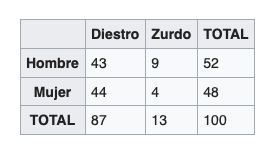

```{r setup, include=FALSE}
knitr::opts_chunk$set(echo = TRUE)
```

# Sesión 4. Repaso de estadísticas descriptivas. 

En la presente sesión, vamos a repasar nuevamente las estadísticas descriptivas, con la base `efc`, la cual, como vimos en la sesión pasada, contiene información sobre **la situación de los cuidadores de adultos mayores en Europa (proyecto EUROFAMCARE)**.

```{r, cache=FALSE, message=FALSE, warning=FALSE}
# Librerias
library(sjmisc)
library(sjlabelled)
library(dplyr)

# Abrimos la base de datos
data(efc)
```

## Conceptos. 

<b style = 'color:red;'>Tablas de contingencia</b>

*En estadística las tablas de contingencia son tablas que se emplean para registrar y analizar la asociación entre dos o más variables, habitualmente de naturaleza cualitativa (nominales u ordinales).*

Estas tablas nos permiten hacer el famoso _cruce de una variable con otra_.



A continuación, un ejemplo: 

_Queremos saber en que manera afecta a la salud de los cuidadores el cuidar a sus adultos mayores. Para eso, queremos cruzar la variable de _Relación con el adulto mayor_, `e15relat`, con la variable `c85cop4`, _¿el acto de cuidar a su adulto mayor ha tenido alguna vez consecuencias en su salud física?_._

Primero hay que conocer dichas variables (obtener sus etiquetas). 

```{r}
# 1. Obtenemos las claves de las variables previamente mencionadas. 

# Etiquetas de relacion 
get_labels(efc$e15relat)

# Etiquetas de salud
get_labels(efc$c85cop4)
```

Después de conocer nuestras variables, ya sacamos las tablas de contingencia.

En R, hay dos formas de calcular las tablas de contingencia: 

* Una es mediante la función `table()` de R base. 

* Otra es mediante la función `flat_table()` que vimos en la sesión pasada, con la librería `sjmisc`. 

A continuación utilizaremos ambas maneras: 

### Con `table()`

Esta es la función básica para sacar tablas de una o múltiples variables. Si se combina con la función `prop.table()`, vamos a poder sacar la tabla de proporciones. 

* Tabla de contingencias con `table()`

```{r}
table(efc$e15relat, efc$c85cop4) 
```

* Proporciones (a lo largo del renglón)

```{r}
prop.table(table(efc$e15relat, efc$c85cop4), margin = 1) 
```

* Proporciones (a lo largo de la columna)

```{r}
prop.table(table(efc$e15relat, efc$c85cop4), margin = 2) 
```

### Con `flat_table()`

Esta función es la mejor para sacar datos de contingencia cuando tenemos bases de datos etiquetadas. 

* Tabla de contingencias con `sjmisc::flat_table()`

```{r}
flat_table(efc, e15relat, c85cop4)
```

* Proporciones (a lo largo del renglon)

```{r}
flat_table(efc, e15relat, c85cop4, margin = "row")
```

* Proporciones (a lo largo de la columna)

```{r}
flat_table(efc, e15relat, c85cop4, margin = "col")
```

# Ejercicios. 

**Tablas de contingencia**

1. Elabore la tabla de contingencias para `c88cop7` y para `e16sex` utilizando `table()` y `flat_table()`. Explique brevemente a que conclusiones llega. 

```{r}
# Que es la etiqueta? 
get_label(efc$c88cop7)

# Con flat_table
flat_table(efc, e16sex, c88cop7, margin = "row")
```

**Medidas de tendencia central**

2. Obtenga la media y la mediana para las variables `e17age` y `c160age`. Las variables ¿tienen valores faltantes?

Igualmente, obtenga los valores máximos y mínimos, la desviación estándar y los principales cuantiles. 


```{r}
# Media
efc %>%
  summarise(media_e17age = mean(e17age, na.rm = T),
            media_c160age = mean(c160age, na.rm = T), 
            mediana_e17age = median(e17age, na.rm = T), 
            mediana_c160age = median(c160age, na.rm = T),
            sd_e17age = sd(e17age, na.rm = T),
            sd_c160age = sd(c160age, na.rm = T)
            )

# Si, hay datos faltantes
table(is.na(efc$e17age))
table(is.na(efc$c160age))

# Principales cuantiles
summary(efc$e17age)
summary(efc$c160age)
```

**Elaboración de gráficas**

3. Obtenga el histograma de frecuencias para las variables arriba mencionadas. ¿Existe algún sesgo? ¿Derecho o izquierdo? 

```{r}

get_label(efc$e17age)
hist(efc$e17age, 
     main="Histograma de edades de los adultos mayores", 
     xlab="Edades",
     ylab = "Frecuencia",
     border="black", 
     col="#3d3d3d",
     xlim=c(50,100),
     breaks=50
     )

hist(efc$c160age, 
     main="Histograma de edades de los cuidadores", 
     xlab="Edades",
     ylab = "Frecuencia",
     border="black", 
     col="#3d3d3d",
     xlim=c(0,100),
     breaks=50
     )


```

**Outliers y distribución de variables**

4. Obtenga un `boxplot` para las variables previamente mencionadas. ¿Existen valores atípicos u _outliers_?

```{r}
boxplot(efc$e17age, efc$c160age)
```

No existen valores atípicos u outliers. 
