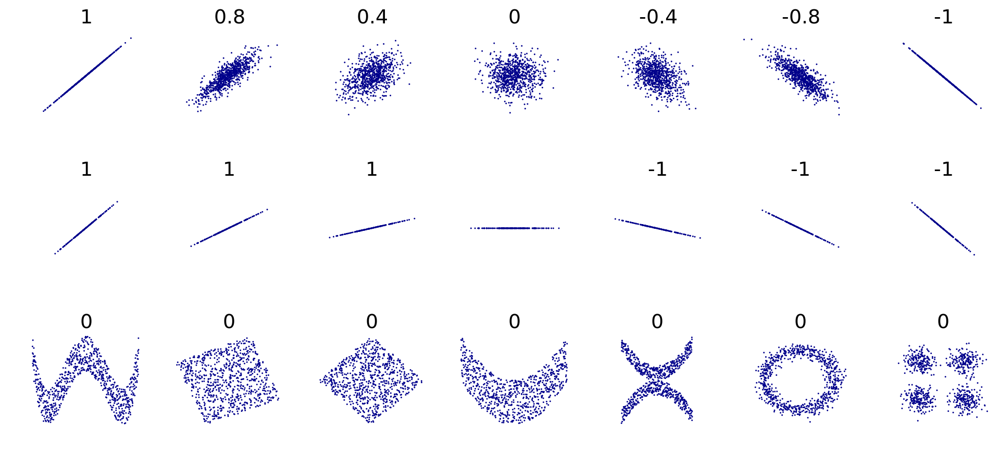

```{r setup, include=FALSE}
knitr::opts_chunk$set(echo = TRUE)
```

# Sobre medias condicionales y correlaciones. 

En la presente sesión, vamos a hacer un repaso de los conceptos nuevos, tanto de estadística como de programación, que se requieren para hacer la tarea 4. 

# Librerias y cosas que necesitamos: 

A continuación, llamamos a las librerías que vamos a ocupar durante el presente laboratorio. 

Recuerda que también puedes usar `pacman::p_load()` para llamar a estas librerías. 

```{r libs, message=FALSE, cache=FALSE, warning=FALSE}
# Librerias
library(tidyverse) # Para usar pipa y verbos dplyr
library(sjmisc) # Para acceder a funciones de vars. etiquetadas
library(sjlabelled) # Para funciones de etiquetamiento
library(haven) # Para leer archivos de programas como SPSS y Stata
options(pillar.sigfig = 7) # Para que nuestras tibbles arrojen mas decimales

```

# Base de datos de ejemplo. 

La base de datos que se muestra a continuación proviene del documento preparado por la UNAM: *Géneros asimétricos. Representaciones y percepciones del imaginario colectivo. Encuesta Nacional de Género.* Para conocer más de este documento, ir al siguiente [enlace](http://www.losmexicanos.unam.mx).

```{r message=FALSE, cache=FALSE, warning=FALSE}
# Base de datos de la tarea 4
bgen <- read_sav("http://www.losmexicanos.unam.mx/genero/encuesta_nacional/base_datos/Encuesta_Nacional_de_Genero.sav") %>% 
mutate(
  sexo= sd1,
  prim= rec(p13, rec= "-1, 99= NA; else= copy", as.num= T), 
  edu= rec(sd4, rec= "1=1 [Ning]; 2:3=2 [Prim]; 4=3 [Sec]; 5:7=4 [Prep]; 8=5 [Lic]; 9:10=6 [Posg]; 98:99= NA"),
  gane= rec(p11_1, rec= "8,9=NA; else= copy", val.labels= get_labels(p11_1))
)
```

# 1. La media o esperanza condicional. 

La esperanza o media condicional puede entenderse (al menos, para este curso) como la obtención de promedios por grupos de observaciones. 

**Ejemplos de la vida real sobre medias condicionales:**

* Uso en encuestas de opinión, condicionando al grupo de edad, sexo o educación al que pertenece un encuestado dado. 

* En clases de finanzas, cuando calculamos el retorno de un bono o acción, condicional al día en el que me encuentro.  

* En artículos científicos, para sacar promedios controlando por variables de control. 

# 2. La función `tapply()`.

La función `tapply()` aplica una función a los valores de un vector dado, cuyos datos se clasifican en torno a un `índice` o vector categórico que agrupa a los datos del primer vector. 

El formato de uso de la función `tapply()` es el siguiente: 

```{r, eval=FALSE}
# ESTE CODIGO NO VA A CORRER SI LO COPIAN, ES MERAMENTE ILUSTRATIVO
# Los argumentos de la función tapply.
tapply(X = vectorNumerico, 
       INDEX = vectorDeAgrupacion, # El vector al que es condicional algo
       FUN = funcionQueSeVaAAplicarAlVectorX, 
       default = accionATomarAnteNAs)
```

**Nota muy importante!** Lo que metan como función al argumento `FUN` debe ser una función sin paréntesis; es decir, si van a sacar medias condicionales a un Index, metanle la función `mean`, no escriban `mean()`.

En la presente clase, vamos a utilizar la función `tapply()` para calcular las medias condicionales.

*Ejemplos*

```{r}

# Por ejemplo, queremos saber el promedio de grado educativo,
## condicional al sexo de los entrevistados
tapply(X = bgen$edu, 
       INDEX  = bgen$sexo, 
       FUN = mean, 
       na.rm= T)

# Edad promedio del primer matrimonio, 
## condicional al sexo del entrevistado
tapply(X = bgen$prim, 
       INDEX  = bgen$sexo, 
       FUN = mean, 
       na.rm= T)

# Edad promedio del primer matrimonio, 
## condicional al nivel educativo del entrevistado
tapply(X = bgen$prim, 
       INDEX  = bgen$edu, 
       FUN = mean, 
       na.rm= T)

# En el tidyverse, lo de arriba seria equivalente en resultado a lo siguiente: 
bgen %>% 
  group_by(edu) %>% 
  summarise(promedio = mean(prim, na.rm = TRUE))

```

# 3. La correlación de Pearson y de Spearman. 

La correlación es una medida que **indica la fuerza y la dirección de una relación lineal** y proporcionalidad entre dos variables estadísticas. 

Se considera que **dos variables cuantitativas están correlacionadas cuando los valores de una de ellas varían sistemáticamente con respecto a los valores homónimos de la otra**.

> Si tenemos dos variables (A y B) existe correlación entre ellas si al disminuir los valores de A lo hacen también los de B y viceversa. 

La correlación entre dos variables **no implica**, por sí misma, **ninguna relación de causalidad**.

La medida más común para medir la correlación es mediante el _coeficiente de correlación de Pearson_, cuya fórmula es la siguiente: 

$$\rho_{pearson}=\dfrac{cov(x,y)}{\sigma_x\sigma_y}$$

Este coeficiente toma valores que van desde -1 hasta 1, pasando por el cero. 

* Un valor de **-1 indíca correlación negativa perfecta**, esto significa que si una variable aumenta, la otra disminuye. 

* Un valor de **1 indíca correlación perfecta**, esto significa que si aumenta la variable x, la variable y aumenta exactamente en una proporción fija. 

* Un valor de **0 indica que no hay nada de correlación**, que las variables no tienen nada que ver unas con otras y, en ciertos casos, que hay independencia de las variables. 

* Los valores intermedios positivos indican que hay cierto grado de correlación, mientras que los negativos indícan que hay un grado de correlación negativa. **En la medida en que se acerquen al 1, al -1 o al 0, podemos emitir un juicio sobre la magnitud de esta relación entre variables.** 

Un ejemplo de estas relaciones lineales se puede observar en la imágen siguiente (en este caso, tenemos que las variables `x` y `y` son variables numéricas contínuas).


De Kiatdd - Trabajo propio, CC BY-SA 3.0, https://commons.wikimedia.org/w/index.php?curid=37108966




Varios grupos de puntos (x, y), con el coeficiente de correlación para cada grupo. Nótese que la correlación refleja la no linealidad y la dirección de la relación lineal. En la figura del centro, la varianza de y es nula, por lo que la correlación es indeterminada.

Si bien, el **coeficiente de correlación de Pearson** es el más utilizado para calcular la correlación, existen otros métodos para realizar este cálculo, como el **coeficiente de correlación de Spearman**, el cuál tiene la ventaja de que admite valores tanto **contínuos como categóricos**, lo cual lo hace útil para este curso.  

# 4. La función `cor()`

La función `cor()` es la función de R que nos permite calcular la correlación entre dos variables, ya sea **utilizando el método de Pearson o el método de Spearman**. 

**Ejemplo**

* Queremos ver si hay alguna relación entre el consumo de gasolina y la velocidad de un automóvil de la base de datos `mtcars` (precargada con el `tidyverse`).

```{r}
# Leemos los datos de mtcars
data("mtcars")

# Queremos hallar la correlaci'on entre el consumo de gasolina y la velocidad que alcanzan los coches de la base de datos. 
mtcars %>% 
  ggplot(aes(x = mpg, # Miles/(US) gallon
             y = qsec # 1/4 mile time
             )) + 
  geom_point() + 
  geom_smooth(method='lm')
  
# Ahora, calculamos la correlaci'on de Pearson 
cor(mtcars$mpg, mtcars$qsec, method = "pearson")
```

**¿Qué nos indica el valor de la correlación?**

> Que hay una relación positiva entre el consumo de gasolina de un automóvil y el tiempo que tarda en recorrer un cuarto de milla. 


**Ejemplo 2**

* Calcula la correlación de Spearman entre `gane` y el nivel educativo, `edu`, de la base `bgen`. ¿Cómo interpretas esos resultados? ¿Qué esperas de la relación entre el desacuerdo con la frase y el nivel educativo?

```{r}
# 1. Qué dice la frase? 
get_label(bgen$gane)

# 2. Cuales son las claves de la respuesta? 
get_labels(bgen$gane)
```

Calculamos la correlación: 

```{r}
ggplot(data = bgen, 
       aes(x = as.factor(edu), 
           y = gane, 
           color = as.factor(edu)
           )) + 
  geom_point()
```

**Explica, qué pasó aquí?!??**

Ahora, cambiando el canal de las marcas (el elemento geométrico) por un `geom_jitter()`: 

```{r}
# Hacemos la grafica: 
ggplot(data = bgen, 
       aes(x = as.factor(edu), 
           y = gane, 
           color = as.factor(edu)
           )) + 
  geom_jitter() 

# Le metemos las medias condicionales a la gr'afica
# Calculamos las medias del grado de desacuerdo, 
## condicional al grado académico. 
mc = tapply(X = bgen$gane, 
                             INDEX = bgen$edu, 
                             FUN = mean, na.rm = T) 

# Lo metemos a una base
baseMediasCondicionales <- tibble(grados = 1:6, 
                                  medias = mc)

# Hacemos la grafica: 
ggplot() + 
  geom_jitter(data = bgen, 
       aes(x = as.factor(edu), 
           y = gane, 
           color = as.factor(edu)
           )) +
  geom_point(data = baseMediasCondicionales,
             aes(x = as.factor(grados),
                 y = medias),
             color = "red", 
             size = 3)

```

Como vemos en la gráfica anterior, lo que estamos haciendo es checar la relación entre dos variables categóricas, por lo que **la correlación de Pearson no nos funciona** y por esto vamos a **usar la correlación de Spearman**.

```{r}
# Calculo de la correlación de Spearman: 
cor(bgen$gane, bgen$edu, method= "spearman", use= "pair")
```

**Nota: ** `use = "pair"` nos dice que para el cálculo utilicemos solo parejas de datos que esten completos tanto en su variable `x` como en su variable `y`.  

* **¿Cómo interpretas esos resultados? **

**R:** Pues que si hay una relación positiva entre el desacuerdo con la frase y el nivel educativo (aunque esa relación es muy débil).

